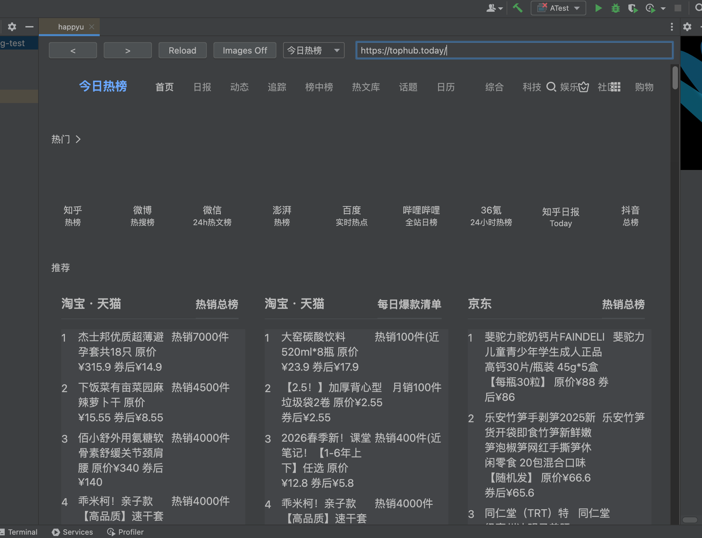
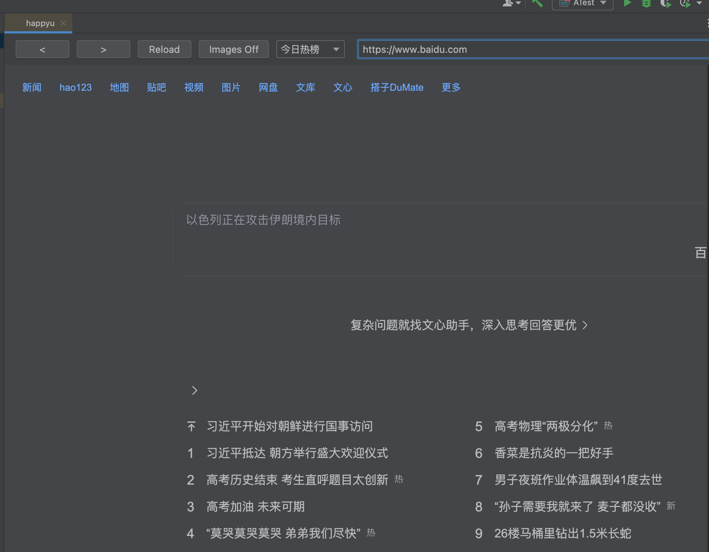

# happyu




摸鱼插件：在编辑器 tab 中打开一个内嵌浏览器，默认屏蔽图片和媒体资源，只保留文字内容。
页面颜色会跟随 IDEA 当前主题，适合低调浏览热搜、榜单和资讯文本。


## 功能

- `Tools -> Open happyu` 打开浏览器 tab。
- 默认打开的首页为 `https://tophub.today/`。
- 可自由输入网址。
- 顶部提供地址栏、返回、前进、刷新、图片开关和常用热榜站点。
- 默认屏蔽图片、favicon、视频等媒体资源，并注入 CSS 隐藏图片、背景图、视频、canvas 等元素。
- 快捷键 `Ctrl+Alt+I` 切换图片屏蔽状态。macOS 上如果和系统快捷键冲突，可在 IDEA 的 Keymap 里调整 `Toggle happyu Images`。
- 网页背景色、文字色、链接色会按 IDEA 当前明暗主题重新注入。

## 兼容版本

- IntelliJ IDEA 2024.1 到 2026.1 系列。
- 对应 IntelliJ Platform build：`241` 到 `261.*`。

## 运行

```bash
./gradlew runIde
```

如果本机已经安装 IntelliJ IDEA，也可以使用本地 IDE SDK：

```bash
gradle runIde -PideaLocalPath="/Applications/IntelliJ IDEA.app/Contents"
```

## 打包

```bash
./gradlew buildPlugin
```

生成的插件包在 `build/distributions/`。

## 开源协议

本项目基于 [MIT License](LICENSE) 开源。
